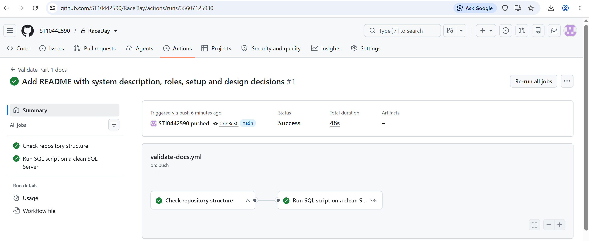

# RaceDay

RaceDay is a web-based event management system for the South African road running, walking and cycling community. Organisers create and manage events, categories and results; participants browse upcoming events, enter them, track their personal results, and check live weather and route information before race day.

This repository is built in three parts for PROG6212 (Programming 2B):

| Part | Scope | Status |
|---|---|---|
| 1 | System planning: ERD, API endpoint plan, SQL database script | ✅ Complete |
| 2 | RESTful API in C#, unit tests, GitHub Actions CI | ⏳ |
| 3 | MVC web app, Azure Blob Storage, Docker | ⏳ |

## Roles

**Organiser** – creates, edits and deletes their own events; manages each event's categories (e.g. 10km, 21.1km); views everyone enrolled in their events; captures and corrects participant results.

**Participant** – registers an account; browses and filters events; enters an event by choosing a category; views their own enrolments; tracks their personal finish times and positions; manages their profile.

## Repository structure

```
/docs
  RaceDay_ERD.png          Entity Relationship Diagram (also as PDF)
  RaceDay_ERD.pdf
  API_Endpoint_Plan.md     Every planned endpoint with role, body and responses
  RaceDay.sql              Creates RaceDayDB, all tables, constraints and seed data
/.github/workflows
  validate-docs.yml        Checks /docs contents and runs the SQL script on a clean SQL Server
```

## Setup (Part 1)

1. Install SQL Server (Developer or Express) and SQL Server Management Studio.
2. Open `docs/RaceDay.sql` in SSMS, connected to your server.
3. Press **Execute (F5)**. The script drops any existing `RaceDayDB`, recreates it, creates all 7 tables and a results view, and inserts the seed data.
4. The final two `SELECT` statements show row counts per table and the results board.

**Seed accounts:** 2 organisers (Lerato Mokoena, Johan van Wyk) and 3 participants (Sipho Dlamini, Aisha Patel, Thandi Nkosi). Password hashes are placeholders until authentication is built in Part 2.

## Design decisions

- **7 entities:** Roles, Users, EventTypes, Events, EventCategories, Enrolments, Results.
- **Users ↔ EventCategories is many-to-many**, resolved by the `Enrolments` junction table. A participant enters an event by choosing a category, so the event is reached through the category.
- **Results is one-to-zero-or-one with Enrolments**: a result can only exist for someone who entered.
- **Positions are calculated, not stored**, in `vw_EventResults`, so corrected times never leave stale positions.
- **Lookup tables** (Roles, EventTypes) instead of free text keep values consistent.

### Differences between the ERD and the SQL script
None. *(Update this section if you deliberately change anything.)*

## CI/CD

The workflow checks that `/docs` holds the ERD, endpoint plan and SQL script, then starts a clean SQL Server 2022 container and runs `RaceDay.sql` to prove it executes without errors.



## Video presentation

Part 1 walkthrough: **[YouTube link – add here]**
